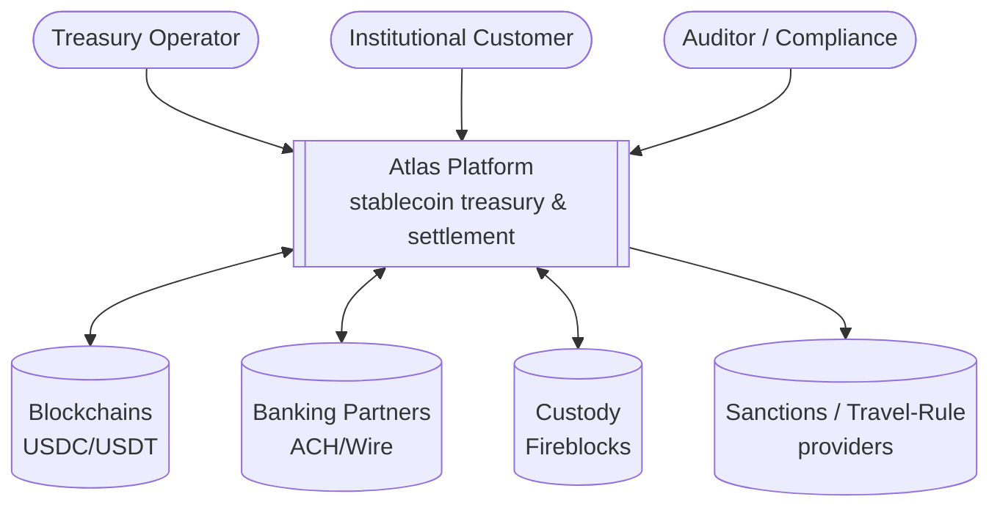
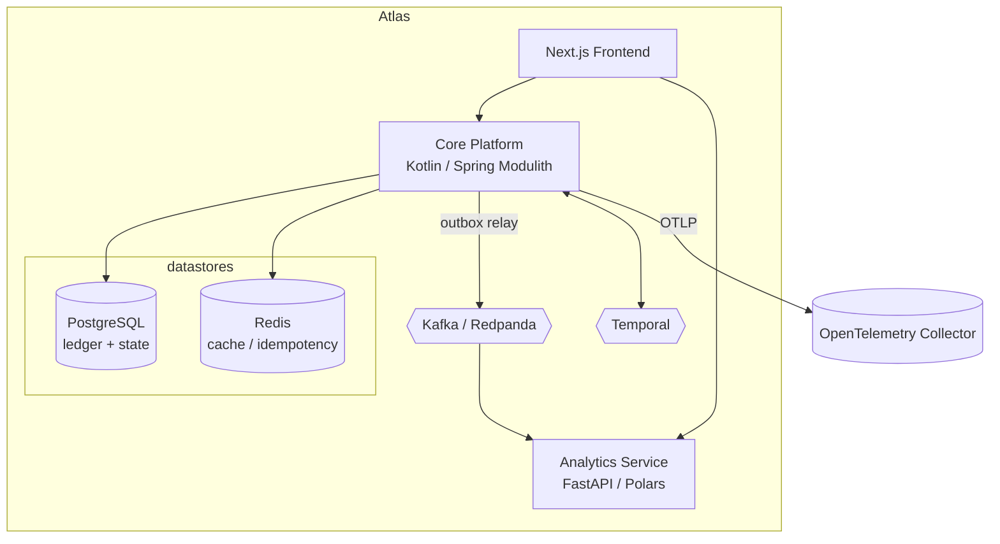
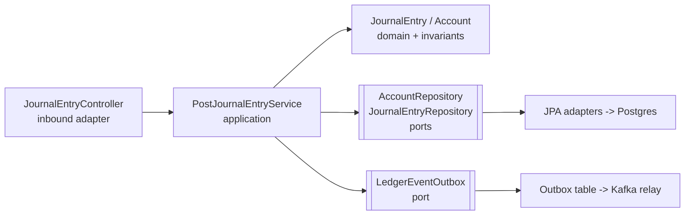

# Atlas — C4 Model (Context + Container)

## Level 1 — System Context

```mermaid
graph TB
    Operator([Treasury Operator])
    Customer([Institutional Customer])
    Auditor([Auditor / Compliance])
    Atlas[["Atlas Platform<br/>stablecoin treasury & settlement"]]
    Chain[(Blockchains<br/>USDC/USDT)]
    Bank[(Banking Partners<br/>ACH/Wire)]
    Custody[(Custody<br/>Fireblocks)]
    Screen[(Sanctions / Travel-Rule<br/>providers)]

    Operator --> Atlas
    Customer --> Atlas
    Auditor --> Atlas
    Atlas <--> Chain
    Atlas <--> Bank
    Atlas <--> Custody
    Atlas --> Screen
```

## Level 2 — Containers

```mermaid
graph TB
    subgraph Atlas
        FE[Next.js Frontend]
        PLATFORM[Core Platform<br/>Kotlin / Spring Modulith]
        ANALYTICS[Analytics Service<br/>FastAPI / Polars]
        subgraph datastores
            PG[(PostgreSQL<br/>ledger + state)]
            REDIS[(Redis<br/>cache / idempotency)]
        end
        KAFKA{{Kafka / Redpanda}}
        TEMPORAL{{Temporal}}
    end

    FE --> PLATFORM
    FE --> ANALYTICS
    PLATFORM --> PG
    PLATFORM --> REDIS
    PLATFORM -- outbox relay --> KAFKA
    PLATFORM <--> TEMPORAL
    KAFKA --> ANALYTICS
    PLATFORM -- OTLP --> OTEL[(OpenTelemetry Collector)]
```

## Level 3 — Component (Ledger module, hexagonal)

```mermaid
graph LR
    WEB[JournalEntryController<br/>inbound adapter] --> SVC[PostJournalEntryService<br/>application]
    SVC --> DOMAIN[JournalEntry / Account<br/>domain + invariants]
    SVC --> REPO[[AccountRepository<br/>JournalEntryRepository<br/>ports]]
    SVC --> OUT[[LedgerEventOutbox<br/>port]]
    REPO --> JPA[JPA adapters -> Postgres]
    OUT --> OBX[Outbox table -> Kafka relay]
```
